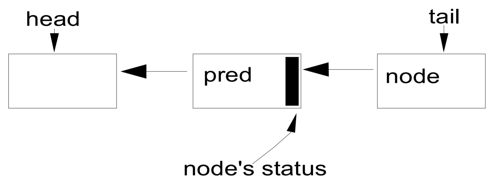
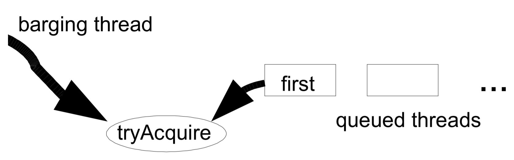

> **参考链接**
>
> [The java.util.concurrent Synchronizer Framework - Doug Lea](http://gee.cs.oswego.edu/dl/papers/aqs.pdf)
>
> [中文翻译版 - 欧振聪](http://ifeve.com/aqs/)

## 摘要

在J2SE 1.5的`java.util.concurrent`包（下称j.u.c包）中，大部分的同步器（例如锁，屏障等等）都是基于`AbstractQueuedSynchronizer`（下称AQS类）这个简单的框架来构建的。这个框架为同步状态的原子性管理、线程的阻塞和解除阻塞以及排队提供了一种通用机制。这篇论文主要描述了这个框架基本原理、设计、实现、用法以及性能。

## 简介

通过JCP的JSR166规范，Java的1.5版本引入了j.u.c包，这个包提供了一系列支持中等程度并发的类。在这些组件中有一系列的同步器（抽象数据类型(ADT)）。这些同步器：

- 维护着一个**内部同步状态**(例如：表示一个锁的状态是获取还是释放)，并提供了相应的操作来更新和检查这个同步状态。
- 至少有一个方法会导致**调用线程被阻塞**（当同步状态需要其阻塞时），并在其他线程改变这个同步状态，允许被阻塞线程执行时**解除线程的阻塞**。

这些的同步器的实例包括不同形式的：

- 互斥排它锁（mutual exclusion locks）
- 读写锁（read-write locks）
- 信号量（semaphores）
- 屏障（barriers）
- Future
- 事件指示器（event indicators）
- 及传送队列等（handoff queues）

<span title="Andrews, G. Concurrent Programming. Wiley, 1991.">几乎任一同步器都可以用来实现其他形式的同步器</span>。例如，可以用可重入锁实现信号量或者用信号量实现可重入锁。但是，这样做带来的复杂性、开销、不灵活使其至多只能是个二流工程。如果任何这样的构造方式不能在本质上比其他形式更简洁，那么开发者就不应该随意地选择其中的某个来构建另一个同步器。而是使用JSR166发布的一个以`AbstractQueuedSynchronizer`为中心的小框架。这个框架为构造同步器提供一种通用的机制，并且被j.u.c包中大部分类使用，此外很多用户也用它来定义自己的同步器。

在这篇论文的下面部分会讨论这个框架的需求、设计与实现背后的主要思路、示例用法，以及性能指标的一些测量。

## 需求

### 功能

同步器一般包含两种方法，一种是acquire，另一种是release。acquire操作阻塞调用的线程，直到/除非同步状态允许其继续执行。而release操作则是通过某种方式改变同步状态，使得一或多个被acquire阻塞的线程继续执行。

j.u.c包中并没有对同步器的API做一个统一的定义。所以，有一些类定义了通用的接口（如Lock），而另外一些则至定义了其专有的版本。因此在不同的类中，acquire和release操作的名字和形式会各有不同。例如：`Lock.lock`、`Semaphore.acquire`、`CountDownLatch.await`和`FutureTask.get`，在框架中，这些方法都被映射到了acquire操作。不过，J.U.C为支持一系列常见的使用选项，在类间都有个一致约定。在有意义的情况下，每一个同步器都支持下面的操作：

- 阻塞和非阻塞（例如tryLock）同步。
- 可选的超时设置，让调用者可以放弃等待
- 通过中断实现的任务取消，通常是分为两个版本：一个版本的acquire可取消，而另一个版本不可以。

同步器的实现根据其是否只维护独占同步状态而有所不同。独占状态的同步器，在同一时间只有一个线程可以通过阻塞点，而共享状态的同步器可以同时有多个线程在执行。一般锁的实现类往往只维护独占状态，但是，例如计数信号量（semaphores）在数量允许的情况下，允许多个线程同时执行。为了使框架能得到广泛应用，这两种模式都要支持。

j.u.c包里还定义了Condition接口，用于支持管程形式的await/signal操作，这些操作与独占模式的Lock类有关，且Condition的实现天生就和与其关联的Lock类紧密相关。

### 性能目标

Java内置锁（使用synchronized的方法或代码块）的性能问题一直以来都在被人们关注，并且<span title="Agesen, O., D. Detlefs, A. Garthwaite, R. Knippel, Y. S. Ramakrishna, and D. White. An Efficient Meta-lock for Implementing Ubiquitous Synchronization. ACM OOPSLA Proceedings, 1999.														Bacon, D. Thin Locks: Featherweight Synchronization for Java. ACM PLDI Proceedings, 1998.">已经有一系列的文章描述其构造</span>。然而，大部分的研究主要关注的是在单核处理器在上下文环境中，如何尽量降低其空间（因为任何的Java对象都可以当成是锁）和时间的开销。对于同步器来说这些都不是特别重要：程序员仅在需要的时候才会使用同步器，因此并不需要压缩空间来避免浪费，并且同步器几乎是专门用在多线程设计中（特别是在多核处理器上），在这种环境下，偶尔的竞争是在意料之中的。因此，常规的JVM锁优化策略主要是针对零竞争的场景，而其它场景则使用较难预测的“慢速路径（slow paths）” ，所以常规的JVM锁优化策略并不适用于严重依赖于J.U.C包的典型多线程服务端应用。

这里主要的性能目标是可伸缩性，即使/特别是在同步器有竞争的情况下，稳定地保证其效率。在理想的情况下，不管有多少线程正试图通过同步点，通过同步点的开销都应该是个常量。在某一线程被允许通过同步点但还没有通过的情况下，使其耗费的总时间最少，这是主要目标之一。然而，这也必须考虑平衡各种资源，包括总CPU时间的需求，内存负载以及线程调度的开销。例如：获取自旋锁通常比阻塞锁所需的时间更短，但是通常也会浪费CPU时钟周期，并且造成内存竞争，所以并不常使用。

这些目标涉及两种通用的使用方式。大部分应用程序是最大化其总的吞吐量，能够最大程度地容忍一定概率的饥饿情况。然而，对于那些控制资源分配的程序来说，更重要是去维持多线程读取的公平性，可以接受较差的总吞吐量。没有任何框架可以替用户去决定选择哪一个方式，因此，应该提供不同的公平策略。

无论同步器的内部实现是多么的精雕细琢，它还是会在某些应用中产生性能瓶颈。因此，框架必须提供相应的监视工具让用户发现和缓和这些瓶颈。至少需要提供一种方式来确定有多少线程被阻塞了。

## 设计与实现

同步器背后的基本思想非常简单。acquire操作如下：

```pseudocode
while (synchronization state does not allow acquire) {
	enqueue current thread if not already queued;
	possibly block current thread;
}
dequeue current thread if it was queued;
```

release操作如下：

```pseudocode
update synchronization state;
if (state may permit a blocked thread to acquire)
	unblock one or more queued threads;
```

为了实现上述操作，需要下面三个基本组件的相互协作：

- 同步状态的原子性管理；
- 线程的阻塞与解除阻塞；
- 队列的管理；

创建一个框架分别实现这三个组件是有可能的。但是，这会让整个框架既难用又没效率。例如：存储在队列节点的信息必须与解除阻塞所需要的信息吻合，而暴露出的方法的签名又依赖于同步状态的性质。

同步器框架的核心决策是为这三个组件选择一个具体实现，同时在使用方式上又有大量选项可用。这里有意地限制了其适用范围，但是提供了足够的效率，使得实际上没有理由在合适的情况下不用这个框架而去重新建造一个。

### 同步状态(Synchronization State)

AQS类使用单个`int`（32位）来保存同步状态，并暴露出`getState`、`setState`以及`compareAndSet`操作来读取和更新这个状态。这些方法都依赖于`java.util.concurrent.atomic`包的支持，这个包提供了兼容JSR133中`volatile`在读和写上的语义，并且通过使用本地的`compare-and-swap`或`load-linked`/`store-conditional`指令来实现`compareAndSetState`，使得仅当同步状态拥有一个**期望值**的时候，才会被**原子地**设置成**新值**。

将同步状态限制为一个32位的`int`是出于实践上的考量。虽然JSR166也提供了64位`long`字段的原子性操作，但这些操作在很多平台上还是使用内部锁的方式来模拟实现的，这会使同步器的性能可能不会很理想。当然，将来可能会有一个类是专门使用64位的状态的。然而现在就引入这么一个类到这个包里并不是一个很好的决定（*译者注：JDK1.6中已经包含`java.util.concurrent.locks.AbstractQueuedLongSynchronizer`类，即使用 long 形式维护同步状态的一个 `AbstractQueuedSynchronizer `版本*）。目前来说，32位的状态对大多数应用程序都是足够的。在j.u.c包中，只有一个同步器类可能需要多于32位来维持状态，那就是`CyclicBarrier`类，因此，它用了锁来代替（该包中大多数更高层次的工具亦是如此）。

基于AQS的具体实现类必须根据暴露出的状态相关的方法定义`tryAcquire`和`tryRelease`方法，以控制acquire和release操作。当成功获取同步，`tryAcquire`方法必须返回`true`，而当新的同步状态允许后续的获取（acquire）时，`tryRelease`方法也必须返回`true`。这些方法都接受一个`int`类型的参数用于传递期望的状态。例如：可重入锁（reentrant lock）中，当某个线程从条件等待中返回，然后重新获取锁时，用来重新设置循环计数的场景。很多同步器并不需要这样一个参数，因此忽略它即可。

### 阻塞

在JSR166之前，还没有Java API可用于阻塞线程和解除线程阻塞，以创建不基于Java内置监视器（monitor）的同步器。唯一可以选择的是`Thread.suspend`和`Thread.resume`，但是它们都有无法解决的竞态问题，所以也没法用：当一个非阻塞的线程在一个正准备阻塞的线程调用`suspend`前调用了`resume`，这个`resume`操作会没有效果。

j.u.c包有一个`LockSuport`类，这个类中包含了解决这个问题的方法。方法`LockSupport.park`阻塞当前线程除非/直到一个`LockSupport.unpark`方法被调用（`unpark`方法被提前调用也是可以的）。`unpark`的调用是没有被计数的，因此在一个`park`调用前多次调用`unpark`方法只会解除一个`park`操作。另外，它们作用于每个线程而不是每个同步器。一个线程在一个新的同步器上调用park操作可能会立即返回，因为在此之前可能有“残留的”`unpark`操作。但是，在没有`unpark`操作时，下一次调用park就会阻塞。虽然可以显式地消除这个状态（*译者注：就是多余的`unpark`调用*），但并不值得这样做。在需要的时候多次调用`park`会更高效。

这个简单的机制与一些平台的功能在某种程度上是相似的，例如Solaris-9的线程库，WIN32中的“consumable events”，以及Linux中的NPTL线程库。因此最常见的运行Java的平台上都有相对应的有效实现。（但目前Solaris和Linux上的Sun Hotspot JVM参考实现实际上是使用一个pthread的condvar（condition variable）来适应目前的运行时设计的）。`park`方法同样支持可选的相对或绝对的超时设置，以及与JVM的`Thread.interrupt`结合 —— 可通过中断来`unpark`一个线程。

### 队列

整个框架的关键就是如何管理被阻塞的线程的队列，该队列是严格的FIFO队列，因此，框架不支持基于优先级的同步。

目前，业界对以下观点很少有争议：同步队列的最佳选择是自身没有使用底层锁来构造的非阻塞数据结构。这其中主要有两个选择：一个是<span title="Mellor-Crummey, J.M., and M. L. Scott. Algorithms for Scalable Synchronization on Shared-Memory Multiprocessors. ACM Trans. on Computer Systems,February 1991">Mellor-Crummey and Scott锁（MCS锁）</span>的变体，另一个是<span title="Craig, T. S. Building FIFO and priority-queueing spin locks from atomic swap. Technical Report TR 93-02-02,Department of Computer Science, University of Washington, Feb. 1993.																Magnussen, P., A. Landin, and E. Hagersten. Queue locks on cache coherent multiprocessors. 8th Intl. Parallel Processing Symposium, Cancun, Mexico, Apr. 1994.																					M. L. Scott and W N. Scherer III. Scalable Queue-Based Spin Locks with Timeout. 8th ACM Symp. on Principles and Practice of Parallel Programming, Snowbird, UT, June 2001.">Craig, Landin, and Hagersten锁（CLH锁）</span>的变体。一直以来，CLH锁仅被用于自旋锁。但是，在这个框架中，CLH锁显然比MCS锁更合适。因为CLH锁可以更容易地去实现“取消（cancellation）”和“超时（timeouts）”功能，因此我们选择了CLH锁作为实现的基础。但是最终的设计已经与原来的CLH锁有较大的出入，因此下文将对此做出解释。

CLH队列实际上并不那么像队列，因为它的入队和出队操作都与它的用途（即用作锁）紧密相关。它是一个链表队列，通过两个字段`head`和`tail`来存取，这两个字段是可原子更新的，两者在初始化时都指向了一个空节点（dummy node）。



一个新的节点，node，通过一个原子操作入队：

```pseudocode
do {
	pred = tail;	//	pred指向tail
} while(!tail.compareAndSet(pred, node));	//	CAS操作，修改tail，预期值旧为pred，修改为node
```

每一个节点的“释放”状态都保存在其前驱节点中。因此，自旋锁的“自旋”操作就如下：

```pseudocode
while (pred.status != RELEASED); // spin
```

自旋后的出队操作只需将head字段指向刚刚得到锁的节点：

```pseudocode
head = node;
```

CLH锁的优点在于其入队和出队操作是快速、无锁的，以及无障碍的（即使在竞争下，某个线程总会赢得一次插入机会而能继续执行）；且探测是否有线程正在等待也很快（只要测试一下head是否与tail相等）；同时，“释放”状态是分散的（*译者注：几乎每个节点都保存了这个状态，当前节点保存了其后驱节点的“释放”状态，因此它们是分散的，不是集中于一块的。*），避免了一些不必要的内存竞争。

在原始版本的CLH锁中，节点间甚至都没有互相链接。自旋锁中，`pred`变量可以是一个局部变量。但是，<span title="M. L. Scott and W N. Scherer III. Scalable Queue-Based Spin Locks with Timeout. 8th ACM Symp. on Principles and Practice of Parallel Programming, Snowbird, UT, June 2001.">Scott和Scherer</span>证明了通过在节点中显式地维护前驱节点，CLH锁就可以处理“超时”和各种形式的“取消”：如果一个节点的前驱节点取消了，这个节点就可以滑动去使用前面一个节点的状态字段。

为了将CLH队列用于阻塞式同步器，需要做些额外的修改以提供一种高效的方式定位某个节点的后继节点。在自旋锁中，一个节点只需要改变其状态，下一次自旋中其后继节点就能注意到这个改变，所以节点间的链接并不是必须的。但在阻塞式同步器中，一个节点需要显式地唤醒（`unpark`）其后继节点。

AQS队列的节点包含一个`next`链接到它的后继节点。但是，由于没有针对双向链表节点的类似`compareAndSet`的原子性无锁插入指令，因此这个`next`链接的设置并非作为原子性插入操作的一部分，而仅是在节点被插入后简单地赋值：

```pseudocode
pred.next = node;
```

`next`链接仅是一种优化。如果通过某个节点的`next`字段发现其后继结点不存在（或看似被取消了），总是可以使用`pred`字段从尾部开始向前遍历来检查是否真的有后续节点。

第二个对CLH队列主要的修改是将每个节点都有的状态字段用于控制阻塞而非自旋。在同步器框架中，仅在线程调用具体子类中的`tryAcquire`方法返回`true`时，队列中的线程才能从`acquire`操作中返回；而单个“released”位是不够的。但仍然需要做些控制以确保当一个活动的线程位于队列头部时，仅允许其调用`tryAcquire`；这时的`acquire`可能会失败，然后（重新）阻塞。这种情况不需要读取状态标识，因为可以通过检查当前节点的前驱是否为`head`来确定权限。与自旋锁不同，读取`head`以保证复制时不会有太多的内存竞争（ there is not enough memory contention reading head to warrant replication.）。然而，“取消”状态必须存在于状态字段中。

队列节点的状态字段也用于避免没有必要的`park`和`unpark`调用。虽然这些方法跟阻塞原语一样快，但在跨越Java和JVM runtime以及操作系统边界时仍有可避免的开销。在调用`park`前，线程设置一个“唤醒（signal me）”位，然后再一次检查同步和节点状态。一个释放的线程会清空其自身状态。这样线程就不必频繁地尝试阻塞，特别是在锁相关的类中，这样会浪费时间等待下一个符合条件的线程去申请锁，从而加剧其它竞争的影响。除非后继节点设置了“唤醒”位（*译者注：源码中为-1*），否则这也可避免正在release的线程去判断其后继节点。这反过来也消除了这些情形：除非“唤醒”与“取消”同时发生，否则必须遍历多个节点来处理一个似乎为null的`next`字段。

同步框架中使用的CLH锁的变体与其他语言中的相比，主要区别可能是同步框架中使用的CLH锁需要依赖垃圾回收管理节点的内存，这就避免了一些复杂性和开销。但是，即使依赖GC也仍然需要在确定链接字段不再需要时将其置为null。这往往可以与出队操作一起完成。否则，无用的节点仍然可触及，它们就没法被回收。

其它一些更深入的微调，包括CLH队列首次遇到竞争时才需要的初始空节点的延迟初始化等，都可以在J2SE1.5的版本的源代码文档中找到相应的描述。

抛开这些细节，基本的`acquire`操作的最终实现的一般形式如下（互斥，非中断，无超时）：

```pseudocode
if(!tryAcquire(arg)) {
	node = create and enqueue new node;
    pred = node's effective predecessor;
    while (pred is not head node || !tryAcquire(arg)) {
        if (pred's signal bit is set)
            pard()
        else
            compareAndSet pred's signal bit to true;
        pred = node's effective predecessor;
    }
    head = node;
}
```

`release`操作：

```pseudocode
if(tryRelease(arg) && head node's signal bit is set) {
    compareAndSet head's bit to false;
    unpark head's successor, if one exist
}
```

`acquire`操作的主循环次数依赖于具体实现类中`tryAcquire`的实现方式。另一方面，在没有“取消”操作的情况下，每一个组件的`acquire`和`release`都是一个O(1)的操作，忽略`park`中发生的所有操作系统线程调度。

支持“取消”操作主要是要在`acquire`循环里的`park`返回时检查中断或超时。由超时或中断而被取消等待的线程会设置其节点状态，然后`unpark`其后继节点。在有“取消”的情况下，判断其前驱节点和后继节点以及重置状态可能需要O(n)的遍历（n是队列的长度）。由于“取消”操作，该线程再也不会被阻塞，节点的链接和状态字段可以被快速重建。

### 条件队列

AQS框架提供了一个`ConditionObject`类，给维护独占同步的类以及实现`Lock`接口的类使用。一个锁对象可以关联任意数目的条件对象，可以提供典型的管程风格的`await`、`signal`和`signalAll`操作，包括带有超时的，以及一些检测、监控的方法。

通过修正一些设计决策，`ConditionObject`类有效地将条件（conditions）与其它同步操作结合到了一起。该类只支持Java风格的管程访问规则，这些规则中，仅当当前线程持有锁且要操作的条件（condition）属于该锁时，条件操作才是合法的（一些替代操作的讨论参考[[4\]](http://ifeve.com/aqs-2/#r4)）。这样，一个`ConditionObject`关联到一个`ReentrantLock`上就表现的跟内置的管程（通过`Object.wait`等）一样了。两者的不同仅仅在于方法的名称、额外的功能以及用户可以为每个锁声明多个条件。

`ConditionObject`使用了与同步器一样的内部队列节点。但是，是在一个单独的条件队列中维护这些节点的。`signal`操作是通过将节点从条件队列转移到锁队列中来实现的，而没有必要在需要唤醒的线程重新获取到锁之前将其唤醒。

基本的`await`操作如下：

```pseudocode
create and add new node to conditon queue;
release lock;
block until node is on lock queue;
re-acquire lock;
```

`signal`操作如下：

```pseudocode
transfer the first node from condition queue to lock queue;
```

因为只有在持有锁的时候才能执行这些操作，因此他们可以使用顺序链表队列操作来维护条件队列（在节点中用一个`nextWaiter`字段）。转移操作仅仅把第一个节点从条件队列中的链接解除，然后通过CLH插入操作将其插入到锁队列上。

实现这些操作主要复杂在，因超时或`Thread.interrupt`导致取消了条件等待时，该如何处理。“取消”和“唤醒”几乎同时发生就会有竞态问题，最终的结果遵照内置管程相关的规范。JSR133修订以后，就要求如果中断发生在`signal`操作之前，await方法必须在重新获取到锁后，抛出`InterruptedException`。但是，如果中断发生在`signal`后，`await`必须返回且不抛异常，同时设置线程的中断状态。

为了维护适当的顺序，队列节点状态变量中的一个位记录了该节点是否已经（或正在）被转移。“唤醒”和“取消”相关的代码都会尝试用`compareAndSet`修改这个状态。如果某次`signal`操作修改失败，就会转移队列中的下一个节点（如果存在的话）。如果某次“取消”操作修改失败，就必须中止此次转移，然后等待重新获得锁。后面的情况采用了一个潜在的无限的自旋等待。在节点成功的被插到锁队列之前，被“取消”的等待不能重新获得锁，所以必须自旋等待CLH队列插入（即`compareAndSet`操作）被“唤醒”线程成功执行。这里极少需要自旋，且自旋里使用`Thread.yield`来提示应该调度某一其它线程，理想情况下就是执行signal的那个线程。虽然有可能在这里为“取消”实现一个帮助策略以帮助插入节点，但这种情况实在太少，找不到合适的理由来增加这些开销。在其它所有的情况下，这个基本的机制都不需要自旋或`yield`，因此在单处理器上保持着合理的性能。

## 用法

AQS类将上述的功能结合到一起，并且作为一种基于“模版方法模式”[[6\]](http://ifeve.com/aqs-3/#r6)的基类提供给同步器。子类只需定义状态的检查与更新相关的方法，这些方法控制着acquire和 release操作。然而，将AQS的子类作为同步器ADT并不适合，因为这个类必须提供方法在内部控制acquire和release的规则，这些都不应该被用户所看到。所有java.util.concurrent包中的同步器类都声明了一个私有的继承了`AbstractQueuedSynchronizer`的内部类，并且把所有同步方法都委托给这个内部类。这样各个同步器类的公开方法就可以使用适合自己的名称。

下面是一个最简单的`Mutex`类的实现，它使用同步状态0表示解锁，1表示锁定。这个类并不需要同步方法中的参数，因此这里在调用的时候使用0作为实参，方法实现里将其忽略。

```pseudocode
class Mutex {
	class Sync extends AbstractQueuedSynchronizer {
		public boolean tryAcquire(int ignore) {
			return compareAndSetState(0, 1);
		}
		public boolean tryRelease(int ignore) {
			setState(0); return true;
		}
	}

	private final Sync sync = new Sync();
	public void lock() { sync.acquire(0); }
	public void unlock() { sync.release(0); }
}
```

这个例子的一个更完整的版本，以及其它用法指南，可以在J2SE的文档中找到。还可以有一些变体。如，tryAcquire可以使用一种“test-and-test-and-set”策略，即在改变状态值前先对状态进行校验。

令人诧异的是，像互斥锁这样性能敏感的东西也打算通过委托和虚方法结合的方式来定义。然而，这正是现代动态编译器一直在重点研究的面向对象设计结构。编译器擅长将这方面的开销优化掉，起码会优化频繁调用同步器的那些代码。

`AbstractQueuedSynchronizer`类也提供了一些方法用来协助策略控制。例如，基础的acquire方法有可超时和可中断的版本。虽然到目前为止，我们的讨论都集中在像锁这样的独占模式的同步器上，但`AbstractQueuedSynchronizer`类也包含另一组方法（如`acquireShared`），它们的不同点在于`tryAcquireShared`和`tryReleaseShared`方法能够告知框架（通过它们的返回值）尚能接受更多的请求，最终框架会通过级联的signal(cascading signals)唤醒多个线程。

虽然将同步器序列化（持久化存储或传输）一般来说没有太大意义，但这些类经常会被用于构造其它类，例如线程安全的集合，而这些集合通常是可序列化的。`AbstractQueuedSynchronizer`和`ConditionObject`类都提供了方法用于序列化同步状态，但不会序列化潜在的被阻塞的线程，也不会序列化其它内部暂时性的簿记（bookkeeping）变量。即使如此，在反序列化时，大部分同步器类也只仅将同步状态重置为初始值，这与内置锁的隐式策略一致 —— 总是反序列化到一个解锁状态。这相当于一个空操作，但仍必须显式地支持以便`final`字段能够反序列化。

### 公平调度的控制

尽管同步器是基于FIFO队列的，但它们并不一定就得是公平的。可以注意到，在基础的acquire算法（3.3节）中，`tryAcquire`是在入队前被执行的。因此一个新的acquire线程能够“窃取”本该属于队列头部第一个线程通过同步器的机会。

可*闯入*的FIFO策略通常会提供比其它技术更高的总吞吐率。当一个有竞争的锁已经空闲，而下一个准备获取锁的线程又正在解除阻塞的过程中，这时就没有线程可以获取到这个锁，如果使用*闯入*策略，则可减少这之间的时间间隔。与此同时，这种策略还可避免过分的，无效率的竞争，这种竞争是由于只允许一个（第一个）排队的线程被唤醒然后尝试acquire操作导致的。在只要求短时间持有同步器的场景中，创建同步器的开发者可以通过定义`tryAcquire`在控制权返回之前重复调用自己若干次，来进一步凸显*闯入*的效果。



可闯入的FIFO同步器只有概率性的公平属性。锁队列头部一个解除了阻塞的线程拥有一次无偏向的机会（*译者注：即不会偏向队头的线程也不会偏向闯入的线程*）来赢得与*闯入*的线程之间的竞争，如果竞争失败，要么重新阻塞要么进行重试。然而，如果*闯入*的线程到达的速度比队头的线程解除阻塞快，那么在队列中的第一个线程将很难赢得竞争，以至于几乎总要重新阻塞，并且它的后继节点也会一直保持阻塞。对于短暂持有的同步器来说，在队列中第一个线程被解除阻塞期间，多处理器上很可能发生过多次*闯入*（*译者注：即闯入的线程的`acquire`操作*）和`release`了。正如下文所提到的，最终结果就是保持一或多个线程的高进展速度的同时，仍至少在一定概率上避免了饥饿的发生。

当有更高的公平性需求时，实现起来也很简单。如果需要严格的公平性，程序员可以把tryAcquire方法定义为，若当前线程不是队列的头节点（可通过`getFirstQueuedThread`方法检查，这是框架提供的为数不多的几个检测方法之一），则立即失败（返回false）。

一个更快，但非严格公平的变体可以这样做，若队列为空（判断的瞬间），仍然允许`tryAcquire`执行成功。在这种情况下，多个线程同时遇到一个空队列时可能会去竞争以使自己第一个获得锁，这样，通常至少有一个线程是无需入队列的。`java.util.concurrent`包中所有支持公平模式的同步器都采用了这种策略。

尽管公平性设置在实践中很有用，但是它们并没有保障，因为Java Language Specification没有提供这样的调度保证。例如：即使是严格公平的同步器，如果一组线程永远不需要阻塞来达到互相等待，那么JVM可能会决定纯粹以顺序方式运行它们。在实际中，单处理器上，在抢占式上下文切换之前，这样的线程有可能是各自运行了一段时间。如果这样一个线程正持有某个互斥锁，它将很快会被切换回来，仅是为了释放其持有的锁，然后会继续阻塞，因为它知道有另外一个线程需要这把锁，这更增加了同步器可用但没有线程能来获取之间的间隔。同步器公平性设置在多处理器上的影响可能会更大，因为在这种环境下会产生更多的交错，因此一个线程就会有更多的机会发现锁被另一个线程请求。

在高竞争下，当保护的是短暂持有锁的代码体时，尽管性能可能会较差，但公平锁仍然能有效地工作。例如，当公平性锁保护的是相对长的代码体和/或有着相对长的锁间(inter-lock)间隔，在这种情况下，*闯入*只能带来很小的性能优势，但却可能会大大增加无限等待的风险。同步器框架将这些工程决策留给用户来确定。

### 同步器

下面是`java.util.concurrent`包中同步器定义方式的概述：

`ReentrantLock`类使用AQS同步状态来保存锁（重复）持有的次数。当锁被一个线程获取时，`ReentrantLock`也会记录下当前获得锁的线程标识，以便检查是否是重复获取，以及当错误的线程（*译者注：如果线程不是锁的持有者，在此线程中执行该锁的`unlock`操作就是非法的*）试图进行解锁操作时检测是否存在非法状态异常。`ReentrantLock`也使用了AQS提供的ConditionObject，还向外暴露了其它监控和监测相关的方法。`ReentrantLock`通过在内部声明两个不同的`AbstractQueuedSynchronizer`实现类（提供公平模式的那个禁用了*闯入*策略）来实现可选的公平模式，在创建ReentrantLock实例的时候根据设置（*译者注：即`ReentrantLock`构造方法中的`fair`参数*）使用相应的`AbstractQueuedSynchronizer`实现类。

`ReentrantReadWriteLock`类使用AQS同步状态中的16位来保存写锁持有的次数，剩下的16位用来保存读锁的持有次数。`WriteLock`的构建方式同`ReentrantLock`。`ReadLock`则通过使用`acquireShared`方法来支持同时允许多个读线程。

`Semaphore`类（计数信号量）使用AQS同步状态来保存信号量的当前计数。它里面定义的acquireShared方法会减少计数，或当计数为非正值时阻塞线程；`tryRelease`方法会增加计数，可能在计数为正值时还要解除线程的阻塞。

`CountDownLatch`类使用AQS同步状态来表示计数。当该计数为0时，所有的acquire操作（*译者注：acquire操作是从aqs的角度说的，对应到`CountDownLatch`中就是`await`方法*）才能通过。

`FutureTask`类使用AQS同步状态来表示某个异步计算任务的运行状态（初始化、运行中、被取消和完成）。设置（*译者注：`FutureTask`的`set`方法*）或取消（*译者注：`FutureTask`的`cancel`方法*）一个`FutureTask`时会调用AQS的`release`操作，等待计算结果的线程的阻塞解除是通过AQS的`acquire`操作实现的。

`SynchronousQueues`类（一种CSP*（Communicating Sequential Processes）*形式的传递）使用了内部的等待节点，这些节点可以用于协调生产者和消费者。同时，它使用AQS同步状态来控制当某个消费者消费当前一项时，允许一个生产者继续生产，反之亦然。

`java.util.concurrent`包的使用者当然也可以为自定义的应用定义自己的同步器。例如，那些曾考虑到过的，但没有采纳进这个包的同步器包括提供WIN32事件各种风格的语义类，二元信号量，集中管理的锁以及基于树的屏障。

## 性能、总结与致谢

此部分与原理关系较小，请移步[The j.u.c Synchronizer Framework翻译(三)使用、性能与总结](http://ifeve.com/aqs-3/#performance)