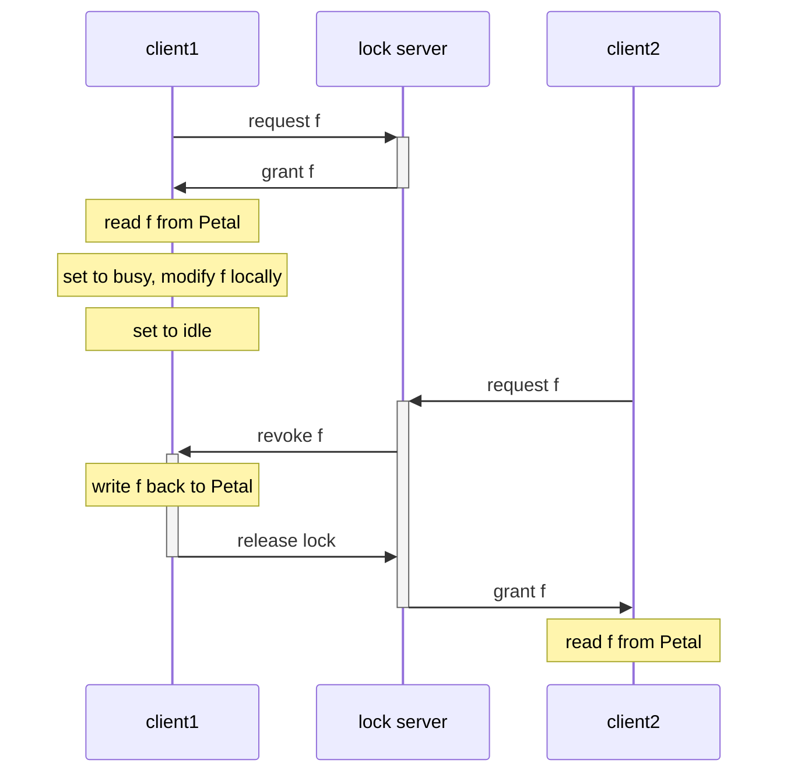

> **参考**
>
> - [MIT 6.824](https://pdos.csail.mit.edu/6.824/schedule.html)
> - [剑桥大学分布式系统](https://www.cl.cam.ac.uk/teaching/2122/ConcDisSys/)
> - [CSE138](https://decomposition.al/CSE138-2021-03/schedule.html)


## 链式复制

### 构建复制状态机的方法
- 将所有操作都提交到共识算法库(Raft/Paxos)
- 更常见的：通过分布式配置服务(Zookeeper) + 主/备复制。配置服务只维护少量状态(如选举结果)，大数据交由主备复制协议执行，减少网络压力

引入链式复制用于主备复制

### 特性
优点
- 在1台server上执行读操作
- 恢复方式简单
- 线性一致性

### 原理
- 配置服务维护server链
- 从head server开始写，tail server回应提交
- 从tail server读取

### 恢复
对比Raft的恢复，简单很多：
- head server宕机：head.next接管成为head（丢弃head新数据是允许的，因为未提交）
- 中间的server宕机：宕机server.prev需要重发数据给宕机server.next
- tail server宕机：让tail.prev接管成为tail

### 添加机器
- 全量克隆原tail server的数据快照
- 应用快照后的增量数据，接管成为新tail

### 对比Raft
- +client请求被分散到head和tail，Raft则集中于leader
- +更新时head只需转发给1台机器，Raft则需广播
- +读操作只徐tail参与，Raft则需quorum
- +简单的恢复机制
- -有一台server宕就需要重新配置，Raft只要仍满足quorum就无需恢复

### 扩展并行读操作
sharding将对象拆分未多条链
```
CH1: S1 -> S2 -> 【S3】
CH2: S2 -> S3 -> 【S1】
CH3: S3 -> S1 -> 【S2】
```
如上，获得三倍的读性能(3个tail)，仍保证线性一致性


## 缓存一致性-Frangipani

### 缓存一致性协议
分布式锁服务器（基于Paxos）：
file    | owner
----    | ----
f       | client1
g       | client2

客户端：
file    | status
----    | ----
f       | busy
g       | idle(sticky lock)




因为工作站访问Petal的文件需要获取锁，并且释放锁之前会将文件修改同步到Petal，所以保证了缓存一致性(cache coherence)，即后续对相同文件进行访问的工作站一定能看到最新的修改内容。

### 原子性
创建文件时，通过通过分布式锁保证内部操作以原子方式进行：
```
fun create("f",..){
	acquire("f")
		allocate inode
		write inode
		update dir("f",inode#)	
	release("f")
}
```
其它client读请求要等待锁释放和写回，不会看到中间状态
file data
### 崩溃恢复
通过预写日志保证元数据(meta data)更新原子性：
1. 先更新日志(通过校验和、整扇区写入保证日志完整)
2. 再应用更新
但文件数据(file data)不保证原子性，通常通过将所有数据写入一个临时文件后做原子重命名来实现。

