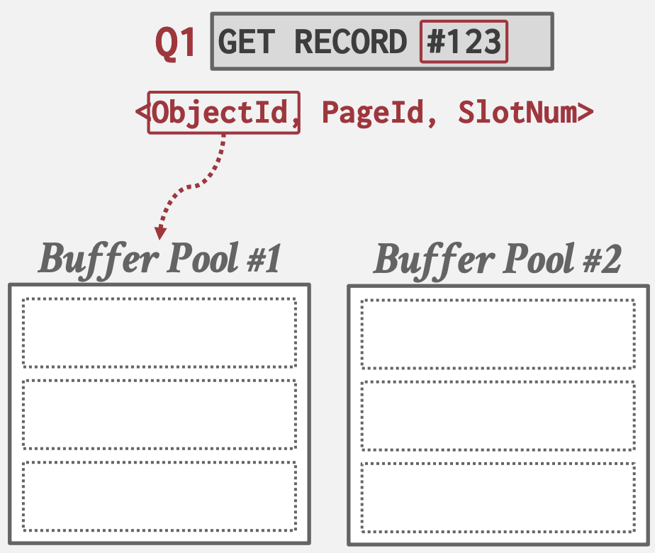
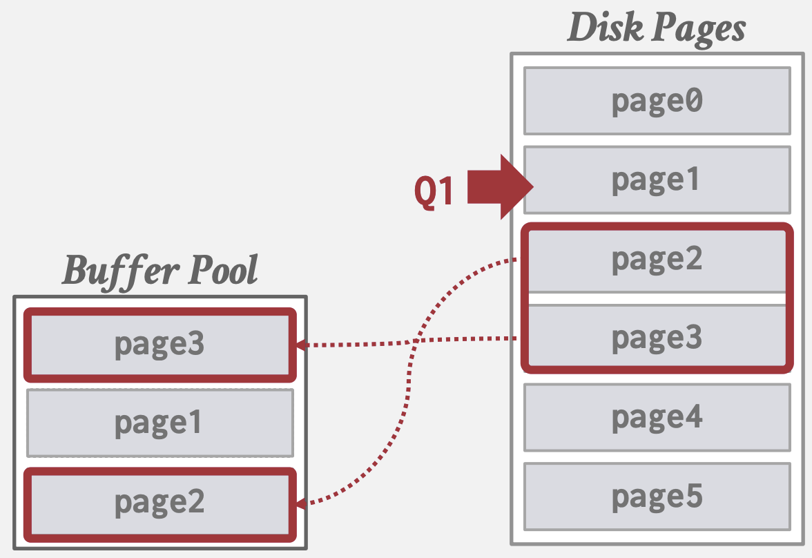
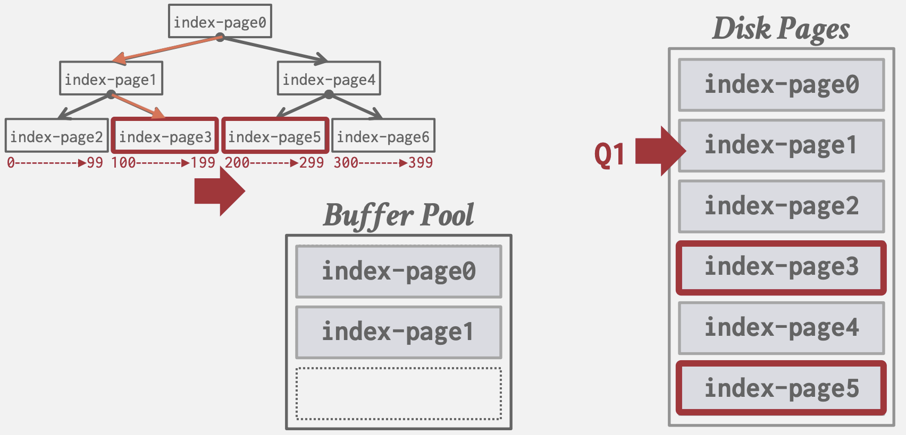

> **参考**
>
> - [CMU 15-445课程主页](https://15445.courses.cs.cmu.edu/fall2023/schedule.html)
> - [CMU 15-445中文字幕视频](https://www.zhihu.com/zvideo/1416127715578032128)


## 存储

### Disk-Oriented DBMS
面向磁盘的DBMS将数据存放于非易失性磁盘，操作数据前需将数据从磁盘读入内存。
- 通过Buffer Pool来管理数据在内存和磁盘之间的置换
- Execution Engine执行查询，向Buffer Pool请求指定page的数据，后者负责将page读入内存返回内存指针
- Buffer Pool Manager需保证该page在Execution Engine执行期间保持在该内存中


### 虚拟内存的问题
为什么不直接以来操作系统虚拟内存?
操作系统虚拟内存(mmap)管理文件在内存和硬盘中的置换，适合只读文件。数据库一般自己管理实现定制化功能(madvice, mlock, msync)：
- 事务需要以正确的顺序flush脏页（并发控制）
- 数据预读取
- 基于语义实现更高效率的缓存置换策略，减少停顿时间
- 线程调度优化
- mmap异常处理困难：校验页, SIGBUS处理
- mmap会导致OS数据结构竞争：TLB shootdowns

### 文件表示
#### 存储管理器(存储引擎)
- 以pages形式管理数据库文件：跟踪页面读写和可用空间
- 读写调度以优化page时间空间局部性

#### Page
固定大小的数据块，用于存储数据库记录。
- 可以包含元组(行)、元数据、索引、日志记录等
- 大多数数据库不混存不同类型数据
- 一些数据库要求页面内容必须自包含（页面存放描述该页内容的元数据，其它页的丢失不会影响该页内容读取）
- 每个页面需要有一个唯一标识，数据库通过间接层来映射page ids和物理存储位置(方便管理，文件位置移动只需修改Page Directory)
- 数据库页面大小：512B-16KB

> 硬件页：设备能够保证“故障安全写入(failsafe)”/原子写入的块

#### Heap file
- 一组无序的page集合
- API: Create/Get/Write/Delete Page
- 支持遍历所有页面
- 通过元数据跟踪已存页面和空余空间

**Page Directory**
特殊的Page：
- 记录每个page id到文件位置的映射
- 记录每个page空闲slots数
- 维护空闲的页面
- 确保Page Directory和数据Page间同步(通过日志解决两种页无法原子写入)


#### Page的布局
每个Page面包含header记录了该页的元数据：
- Page size.
- Checksum.
- DBMS version.
- Transaction visibility
- Self-containment. ([自包含元数据](#页面page))

Page内部如何存储数据
- [Slotted Pages Storage](#Slotted-Pages-Storage)
- [Log Structured Storage](#Log-Structured-Storage)

##### Slotted Pages Storage
多数DBMS使用的方法
- slot数组: 映射每个元组(Tuple)的起始偏移量。
- Header记录已使用slot数，最后一个slot的偏移量

- 添加tupe时, slot数组从头部向尾部增长, 而tupe数据则从尾部向头部增长，两个部分重叠时标志page已满

- 通过slot数组的间接映射，page内部可实现系统上层无感地移动Tuple，只需修改对应slo数组偏移量即可，上层依旧能通过同样的page id + slot数组下标查找，如一些数据库会在Tuple删除后执行compact操作。

缺点
- 碎片化：删除tuples会在page中产生gap
- 随机IO访问: 更新不同位置的tuples性能差
- 多余的IO: 更新tuples需要读取整块磁盘page

**Index-Organized Storage**
- Page存储索引数据结构
- 将Tuple作为value存储至索引数据结构中
- 通常根据key的排序存储
- 如MySQL的聚簇索引将tuple存储在B+树的叶子结点中


**Record Id**
- 标识Tuple的唯一id
- 通常为: file_id + page_id + offset/slot
- 可能包含文件位置的时机

##### Log Structured Storage
- Page中存储Log Records: 记录了Tuple的修改信息
- 每个Log Entry表示了一个Tuple的Put/Delete操作, 且包含Tuple的唯一标识
- Put Record包含了Tuple内容, Delete Record将Tuple标记为已删除
- 利用磁盘顺序访问速度快的特性: 在内存中append Log Records, 顺序地写入磁盘, 已落盘page不可修改

- 但读取时需要从新到旧扫描Log Records
- 通过构建index，将Tuple映射到最新Log Record偏移量

- 可以周期性compact, 使Tuple只保留一条记录

- 通过[Sorted String Tables](http://ddia.vonng.com/#/ch3?id=sstables%e5%92%8clsm%e6%a0%91)(SSTables)维护id有序索引加速查找

- 分层并维护多个SSTables即[Log-Structured Merge-Tree](http://ddia.vonng.com/#/ch3?id=sstables%e5%92%8clsm%e6%a0%91)(LSM tree)
- Write-Amplification(写入放大): compact时需要从磁盘读出, 合并后再次写入

#### Tuple的布局

```
Tuple:
| Header | Attribute Data |
```

- Header记录元数据如：可见信息、NULL值的BitMap等
- Data部分存放属性的实际值(以字节序列形式)，通常按创建table时指定的顺序存储
- [Catalogs](#Catalogs)包含table的schema信息, 以此来解释Attribute Data的类型和值
- 多数DBMS不允许Tuple大小超过一个page，因为要额外的元数据和指针来表示剩余部分所在overflow page
- 可能有反范式化Tuple数据，如prejoin会将不同表的相关的Tuples存储到同个page。可读取降低IO但是更新成本高

**字长对齐**
- 为了性能: 减少跨缓存行
- 减少错误: 有些ISA不支持非对齐访问([如ARM早期版本](https://medium.com/@iLevex/the-curious-case-of-unaligned-access-on-arm-5dd0ebe24965))
对齐方式有：
- 添加padding字节
- 重排序tuple的属性凑整字节

**数据类型表示**
- 变长类型如VARCHAR/VARBINARY/TEXT/BLOB: header记录长度, 跟着实际数据字节序列(大数据则存储指向External File的指针)
- 时间日期类型如TIME/DATE/TIMESTAMP: 32/64位integer表示的Unix Epoch时间戳
- Null Data Types: 
    - NULL Column Bitmap Header: 常用, bitmap指明哪些属性为NULL
    - Special Value: 如用`INT_32MIN`来代表NULL
    - 各属性都记录一个NULL Flag: 由于字节对齐可能会耗费超过1bit空间
- 定点数类型如NUMERIC/DECIMAL: 通常以精确的变长二进制形式(如string) + 额外的元数据(如长度和小数点位置)存储，如[PostgreSQL](https://github.com/postgres/postgres/blob/94415b04ed0d1f3334c413924e367b25df57f2fd/src/interfaces/ecpg/include/pgtypes_numeric.h#L18)和[MySQL](https://github.com/mysql/mysql-server/blob/19feac3674e2ae254b3e7fa7e116fc64ac284d8d/include/decimal.h#L51)。以性能换准确性, 如[PostgreSQL](https://github.com/postgres/postgres/blob/94415b04ed0d1f3334c413924e367b25df57f2fd/src/interfaces/ecpg/pgtypeslib/numeric.c#L637)
和[MySQL](https://github.com/mysql/mysql-server/blob/19feac3674e2ae254b3e7fa7e116fc64ac284d8d/strings/decimal.cc#L1840)

### Catalogs
Catalogs存放了数据库的元数据:
- Tables, columns, indexes, views
- Users, permissions
- Internal statistics

多数DBMS将Catalogs存储在特殊的tables中，如INFORMATION_SCHEMA, 用代码初始化该table


## 存储模型

### 工作负载类型
- 联机事务处理OLTP(On-Line Transaction Processing): 简单读写少量entity数据
- 联机分析处理OLAP(On-Line Analytical Processing): 读取大数据进行复杂查询
- 混合事物分析处理HTAP(Hybrid Transaction/Analytical Processing): 同时支持OLTP和OLAP
不同的存储模型适应于不同的工作负载:

### N-ary Storage Model
即Row Storage(行式存储). 将每个tuple的属性连续存储到page中
适用于OLTP: 只操作常数个entity, 大量执行insert操作.
- +insert, update, delete 很快
- +对于需要整个tuple的查询很友好
- +可以利用Index-Organized Storage
- -对于扫描大量tuple且只要其部分属性的查询效率低: 读取大量无用数据, 内存局部性差
  
  ```sql
  SELECT COUNT(U.lastLogin),
      EXTRACT(month FROM U.lastLogin) AS month
  FROM useracct AS U
  WHERE U.hostname LIKE '%.gov'
  GROUP BY EXTRACT(month FROM U.lastLogin)
  ```
  
  
- -不利于压缩: 单个tupe各属性值域不同压缩率低

### Decomposition Storage Model
即Column Storage(列式存储). 将所有tuple中一列属性连续存储到page中
适用于OLAP: 只读扫描整个table的部分属性

- +减少不必要的IO, 只读取需要的属性
- +提高了内存局部性和缓存命中率
- +更利于数据压缩
- -对于点查询, inserts, updates, deletes慢, 因为Tuple得进行splitting拆分/stitching拼接/reorganization重组

Tuple拆分和拼接(关联同个Tuple的不同属性):
- Fixed-length Offsets: 同一个属性, 值的长度相同. 同个tuple不同列值的offset相同, 该offset = 内存偏移地址 / 属性固定长度. 通过dictionary compression将变长数据转换为定长值.

- 内置tuple id: 列的每一个值都额外保存一个tuple id; 还需要一个表来映射tuple id到所有属性值的位置.


### Partition Attributes Across
混合了两种模式, 为了能获益于DSM的性能同时保持NSM的空间局部性: 前面OLAP查询例子中WHERE如果需要扫描多个属性, DSM的拆分会导致局部性不佳.
先将table的rows水平分割成rows group, 每个row group的属性再垂直切割成按列存储.
全局header中directory维护每个row group在文件中的offset.


比如, [Parquet](https://youtu.be/1j8SdS7s_NY?t=705)将row group大小设置为128MB:


## 压缩
- 压缩能增加每次IO获取的数据量, 减少DRAM要求
- 权衡计算速度 vs 压缩率

目标
- 生成定长值(变长的属性存到另外的pool)
- 执行查询时尽量推迟解压缩
- 无损

粒度
- Block Level: Tuple中的块
- Tuple Level: 整个tuple (适用于NSM)
- Attribute Level: 一个tuple中的一或多个属性
- Columnar Level: 多个tuple的相同属性(适用于DSM)

### Naive Compression
朴素地使用通用压缩算法以二进制形式压缩, 如gzip, LZO, LZ4, Snappy, Brotli, Oracle
OZIP, Zstd.
工程上通常不会用太高压缩率的算法保证压缩/解压速度.
朴素压缩没有考虑schema的高级语义, 无法对查询计划进行优化.
[MySQL Innodb](https://dev.mysql.com/doc/refman/8.0/en/innodb-compression-internals.html)使用了该方式:
- 将Page划分对齐为若干KB, 以减少每次读写时压缩解压的范围, 存储到Buffer Pool
- 为了避免每次写都进行解压, 将写记录到额外的mod log; 读取时记录在mod log则无序解压已压缩Page.


### Columnar Compression
我们希望DBMS能够无需解压, 通过将查询转换, 直接操作已压缩数据. 可以利用以下DSM的Columnar Compression算法
**Run-Length Encoding (RLE)**
- 将列中相同的值压缩为3元组: (属性值, 开始位置, 连续个数)

- 更适用于已排序列
- 通过转换查询直接操作已压缩数据:

```sql
SELECT isDead, COUNT(*)
 FROM users
GROUP BY isDead
-- 转化为sum(连续个数)
```

**Bit-Packing Encoding**
列中所有值都比数据类型定义的范围小, 则直接截断bit数


**Mostly Encoding**
Bit-Packing的变种, 对于小部分超出范围无法压缩的值特别维护一张表存储.


如[Amazon Redshift](http://docs.aws.amazon.com/redshift/latest/dg/c_MostlyN_encoding.html)使用了Mostly Encoding

**Bitmap Encoding**
- 为属性的每个唯一value存储一个bitmap, 某value的bitmap的第i位代表第i个tuple是否有该value, 从而无需重复地存储重复的value
- 为了避免分配大块连续内存, 可以将bitmap分割成若干block
- 仅适用于value集合的基数/势较低的属性, 否则bitmap可能比原始数据大


如一些数据库提供的[bitmap indexes](https://dbdb.io/browse?indexes=bitmap)

**Delta Encoding**
- 记录同一列中相邻value的差值
- 基值可以是原列中的的, 或单独存储一个查找表
- 可以结合RLE使用


**Dictionary Compression**
- 将频次高的value替换为更小的定长code, 并维护code到原始值的映射(dictionary)
- DBMS最常使用的压缩方式
- 支持快速编码/解码以及范围查询
- 支持保留与原始值相同的顺序排序

- 优化: 如果只对压缩列进行distinct查询, 则只需读取dictionary无需扫描原列:

```sql
-- 仍然需扫描原列
SELECT name FROM users
WHERE name LIKE 'And%'

-- 只需读取dictionary
SELECT DISTINCT name
 FROM users
WHERE name LIKE 'And%'
```

Dictionary数据结构
- Array: 简单但更新成本高; 适用于不可变数据

- Hash: 速度快且紧凑; 但不支持范围和前缀查询
- B+ Tree: 比hash table慢些, 且占用更多内存; 但支持范围查询和前缀查询

## 内存管理

### 目的


**空间控制** 
- Page在磁盘上的写入位置
- 目标: 尽可能将经常一起使用的Page在磁盘上物理上靠近

**时间控制**
- 何时将Page读入内存以及何时将其写入磁盘
- 目标: 最小化由于从磁盘读取数据而导致的停顿次数

### Locks和Latches

**Locks**
- **高级别**的**逻辑**原语，用于保护数据库的逻辑内容(如元组、表、数据库)免受其他**事务**的干扰
- Lock将在其整个事务持续时间内持有
- 数据库系统可以向**用户公开**查询运行时持有的锁
- 锁需要能够**回滚更改**

**Latches**
- DBMS在其**内部数据结构**(如哈希表、内存区域)的临界区使用的**低级别**保护原语
- 只在执行操作的时间内持有
- 无需回滚更改

### Buffer Pool

#### 内存组织
- 在数据库内分配的一个大内存区域，用于存储从磁盘读取的Page
- 组织成一个Page的数组, 每个条目称为一个frame
- 当DBMS请求一个Page时，它会从磁盘复制到Buffer Pool的一个Frame中
- 脏页面可以被缓存起来，不立即写回
- 需要Latch来解决Page Table的线程竞争修改


#### Page Table
- 一个在内存中的哈希表，用于跟踪当前在内存中的Page
- 将Page ID映射到Buffer Pool中的Frame位置; 由于Buffer Pool中Page的顺序不一定和磁盘上的顺序一致，需要该间接层来确定Page位置
- 维护每个Page的额外元数据:
  - 脏标志: 由线程在修改Page时设置, 向存储管理器指示Page必须写回磁盘
  - 引用计数: 跟踪当前访问该Page的线程数(读取或修改), 大于零则不允许存储管理器从内存中逐出该Page
  - 访问跟踪信息: TODO

#### 内存分配策略

**全局策略**
为所有活动事务找到分配内存的最佳决策

**本地策略**
- 使单个查询或事务运行更快的决策, 不考虑并发的事务
- 但需要支持page共享: TODO

大多数系统使用全局和本地视图的组合

### Buffer Pool优化

**多个Buffer Pool**
DBMS可以为不同的目的维护多个Buffer Pool, 如:
- 每个数据库一个Buffer Pool
- 每个Page类型一个Buffer Pool
每个Buffer Pool都可以采用适合其存储数据的策略; 有助于减少Latch争用并提高局部性。
将Page映射到Buffer Pool的方法:
- Object ID: 扩展Record ID以包含Object ID, 通过其将对象映射到特定Buffer Pool

- Hash: 对PageID进行哈希以选择Buffer Pool。

**预取**
通过基于查询计划, 进行Page预取来进行优化:
- 在处理第一组Page时，预取第二组Page

- 根据树索引预取叶子Page

```sql
SELECT * FROM A
WHERE val BETWEEN 100 AND 250
```



**扫描共享（同步扫描）**
查询游标可以重用从存储中检索的数据或运算符计算的数据。这允许多个查询连接到扫描表的单个游标。如果一个查询开始扫描，如果已经有一个查询正在执行此操作，那么DBMS将将第二个查询的游标连接到现有游标。DBMS跟踪第二个查询加入第一个查询的位置，以便在到达数据结构末尾时完成扫描。
Buffer Pool绕过顺序扫描运算符不会将获取的Page存储在Buffer Pool中以避免开销。相反，内存是运行查询的本地内存。如果运算符需要读取磁盘上连续的大量Page，则Buffer Pool绕过可以用于临时数据（排序、连接）。

### 缓冲替换策略
当DBMS需要释放一个帧以腾出空间给新Page时，它必须决定从Buffer Pool中驱逐哪个Page。
替换策略是DBMS实施的一种算法，用于在需要空间时决定从Buffer Pool中驱逐哪些Page。
替换策略的实施目标是提高正确性、准确性、速度和元数据开销。
最近最少使用（LRU）
最近最少使用的替换策略维护每个Page上一次访问的时间戳。DBMS选择驱逐具有最旧时间戳的Page。此时间戳可以存储在单独的数据结构中，如队列中，以进行排序并通过减少淘汰时的排序时间来提高效率。
CLOCK
CLOCK策略是LRU的一种近似，无需每个Page都有单独的时间戳。在CLOCK策略中，每个Page都有一个引用位。当访问Page时，将其设置为1。
为了可视化，将Page组织成带有“时钟手”的循环缓冲区。在扫描时，检查Page的位是否设置为1。如果是，则将其设置为零；如果不是，则将其淘汰。通过这种方式，时钟手记住了淘汰之间的位置。
替代方案
LRU和CLOCK替代策略存在一些问题。
15-445/645 数据库系统
第3页 共5页
2023年秋季 – 第06讲 Buffer Pool
图3：CLOCK替代策略的可视化。Page1被引用并设置为1。
当时钟手扫过时，它将Page1的引用位设置为0，并淘汰Page5。
换句话说，LRU和CLOCK易受到顺序泛滥的影响，其中由于顺序扫描而使Buffer Pool的内容受损。由于顺序扫描快速读取许多Page，Buffer Pool会填满，并且其他查询的Page会被淘汰，因为它们的时间戳较早。在这种情况下，最近的时间戳不准确反映我们实际想要淘汰的Page。
有三种解决LRU和CLOCK策略缺陷的方法。
一种解决方案是LRU-K，它跟踪最近K个引用的历史作为时间戳，并计算连续访问之间的间隔。此历史用于预测下一次访问Page的时间。
另一种优化是每个查询的本地化。DBMS选择在每个事务/查询基础上淘汰哪些Page。这减少了每个查询对Buffer Pool的污染。
最后，优先级提示允许事务根据查询执行期间每个Page的上下文告诉Buffer PoolPage是重要还是不重要。
脏Page
处理带有脏位的Page有两种方法。最快的选项是丢弃Buffer Pool中不脏的任何Page。较慢的方法是将脏Page写回磁盘，以确保其更改被持久化。这两种方法说明了快速淘汰与写回将来不会再次读取的Page之间的权衡。
避免不必要写出Page的问题的一种方法是背景写入。通过背景写入，DBMS可以定期遍历Page Table并将脏Page写回磁盘。当脏Page安全写入时，DBMS可以驱逐Page或仅取消脏标志。

### 其他内存池
DBMS需要内存来存储除了元组和索引之外的其他信息。这些其他内存池根据具体实现可能并不总是由磁盘支持。
• 排序 + 连接缓冲区
• 查询缓存
• 维护缓冲区
• 日志缓冲区
• 字典缓存

### 操作系统页面缓存
大多数磁盘操作通过操作系统API进行。除非明确说明，否则操作系统会维护自己的文件系统缓存。
大多数DBMS使用直接I/O来绕过操作系统的缓存，以避免页面的冗余复制和管理不同的淘汰策略。
Postgres是一个使用操作系统页面缓存的数据库系统的例子。

### 磁盘I/O调度
DBMS维护内部队列来跟踪来自整个系统的页面读写请求。任务的优先级取决于多个因素：
• 顺序 vs. 随机I/O
• 临界路径任务 vs. 后台任务
• 表 vs. 索引 vs. 日志 vs. 瞬时数据
• 事务信息
• 基于用户的服务水平协议（SLAs）